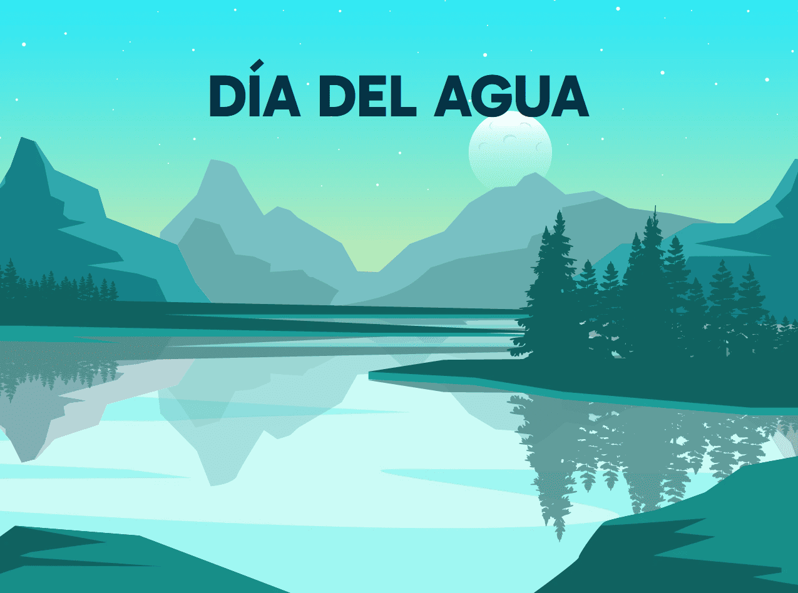

# 💦 Día del Agua - El Quiz Definitivo

¿Eres un maestro del ahorro de agua o un villano del derroche? Descúbrelo aquí. 🚰⚡

## 🤔 ¿Qué es esto?

Esto no es un simple quiz. Es una misión, una prueba, un desafío épico para determinar si eres un guardián del agua o si, bueno... mejor ni te decimos. 😬

Tendras que responder 7 preguntas y, según tus respuestas, obtendrás un feedback brutalmente honesto. Al final, tu puntaje determinará tu nivel de conciencia hídrica.

## 🏆 Niveles de Maestro del Agua:

- 🌊 Experto (18 - 21 puntos): Probablemente puedas caminar sobre el agua. Maestro del ahorro hídrico, te hacemos una reverencia. 🙌

- 💧 Avanzado (14 - 17 puntos): Haces lo tuyo, pero aún puedes mejorar. Tu ducha es corta, pero no tan corta. 🛀

- 🚿 Básico (10 - 13 puntos): Sabes lo básico, pero a veces se te escapa una llave abierta. Ups. 😬

- 🔥 Crítico (6 - 9 puntos): Tus acciones preocupan a los peces. Peligro de sequía inminente. 🌵

- 💀 Emergencia (0 - 5 puntos): STOP. El planeta llora cada vez que abres una llave. 😭

## 🛠 Tecnologías Utilizadas

- React con Vite: Porque rápido es mejor. ⚡

- Tailwind CSS: Para que se vea bonito sin escribir CSS a mano (porque no somos masoquistas). 🎨

- React State & Hooks: Porque tenemos memoria, aunque olvidemos cerrar la llave. 🤓

## 🚀 Instalación y Ejecución

1. Clona este repositorio:

2. Entra a la carpeta del proyecto:

3. Instala las dependencias:

4. Arranca el servidor:

5. Ábrelo en el navegador (probablemente en http://localhost:5173).

## 🎯 Cómo jugar

- Lee cada pregunta y selecciona la opción que más te represente (o que menos vergüenza te dé admitir). 😅

- Cada opción tiene una puntuación oculta (1-3 puntos).

- Recibirás feedback inmediato (no nos hacemos responsables de daños emocionales 😆).

- Al final, se suma tu puntuación y se te otorga un nivel.

## 📸 Vista Previa

## 📢 Contribuciones

Si quieres agregar nuevas preguntas, mejorar la interfaz o simplemente dejar un meme sobre el agua, eres bienvenido. 🚰

## 🏅 Créditos

Creado con mucho humor, un poco de sarcasmo y mucha conciencia ecológica por Nicolás. 🌍💙

## 📜 Licencia

MIT. Haz lo que quieras, pero no desperdicies agua. 💦

